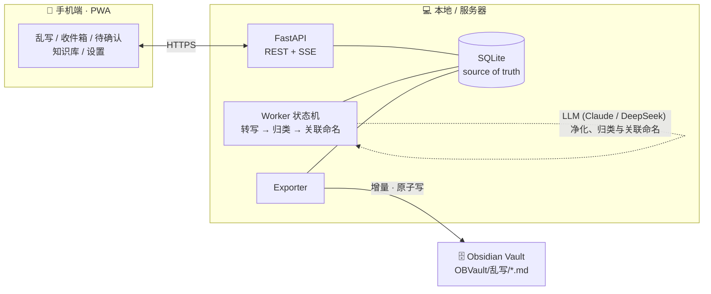
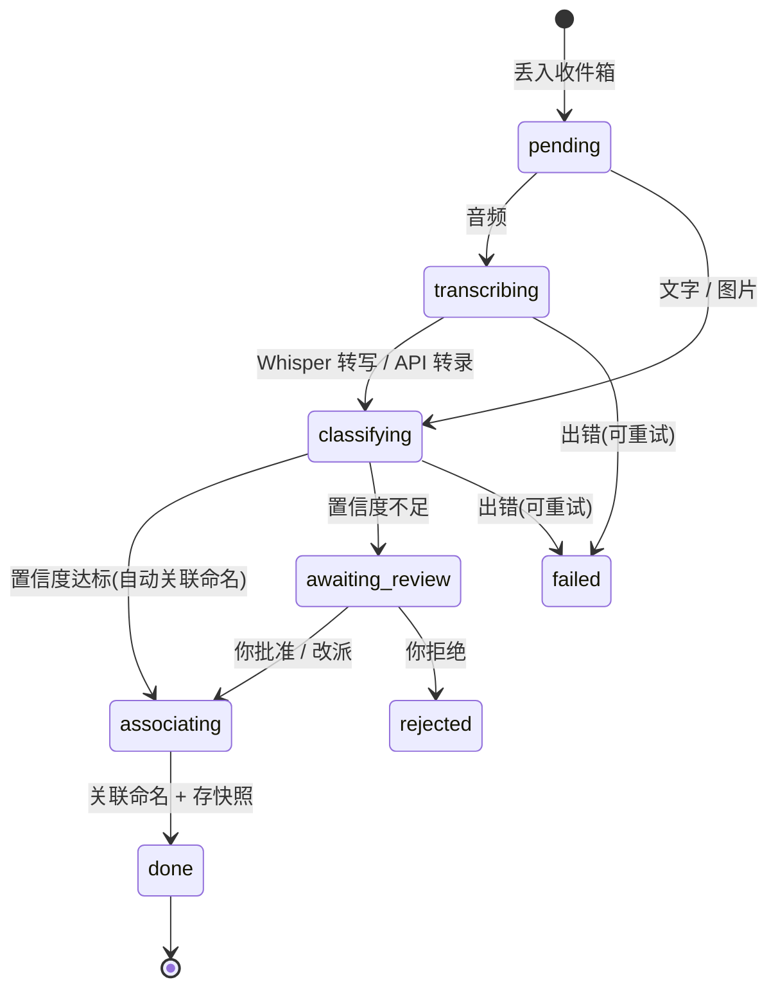

<div align="center">

# 乱写

**随手丢进语音、文字、照片,AI 帮你循序渐进地长出一座知识库。**

原文永远留底 · 净化不改写 · 合并可回滚 · 数据全在你自己的机器上

<p>
  
  
  
  
  
  
</p>

<p>
  <a href="#核心特性"><b>核心特性</b></a> ·
  <a href="#界面"><b>界面</b></a> ·
  <a href="#工作原理"><b>工作原理</b></a> ·
  <a href="#快速开始"><b>快速开始</b></a> ·
  <a href="#配置env"><b>配置</b></a> ·
  <a href="../../issues"><b>反馈</b></a>
</p>

<table>
  <tr>
    <td align="center" width="50%">
      <br/>
      <sub><b>随手丢</b> — 语音 / 文字 / 照片,想到什么丢什么</sub>
    </td>
    <td align="center" width="50%">
      <br/>
      <sub><b>收件箱</b> — 每条先原样存底,再看它怎么被处理</sub>
    </td>
  </tr>
  <tr>
    <td align="center" width="50%">
      <br/>
      <sub><b>待确认</b> — AI 拿不准的,你一键批准 / 改派 / 拒绝</sub>
    </td>
    <td align="center" width="50%">
      <br/>
      <sub><b>知识库</b> — 主题会自己长出来,越写越厚</sub>
    </td>
  </tr>
</table>

</div>

## 它解决什么

想法来的时候往往很碎:一段语音、几句吐槽、一张白板照片。传统笔记要你当场分好类、写清楚,于是大多数碎片根本没被记下来。

乱写反过来:**先无脑丢进来,整理交给 AI。** 每条碎片先原样存进收件箱，AI 在后台将其提炼成净化文本并自动判断主题归属。拿得准的直接关联进主题卡片并由“合并 AI”大模型自动为子卡片和主题进行专业命名，拿不准的则进入「待确认」留给用户一键批准、改派或拒绝。每个大主题包含多张清晰独立的子卡片，数据全部留存本地 SQLite + media/。

和常见做法比，乱写的取舍集中在三条铁律上——**原文不丢、转写不改写、合并不丢信息:**

| 维度 | 转写类笔记工具 | 云端「第二大脑」 | **乱写** |
|---|---|---|---|
| 原始素材 | 通常只留转写后的文本 | 上传到云端 | **原文 / 原音频 / 原图永久留底,任何 AI 结果都能重放** |
| 转写处理 | 可能顺手润色、改写 | — | **只去语气词、纠错别字,不改你的原话** |
| 并进笔记 | 多为末尾追加 | AI 自动重组,可能悄悄丢信息 | **关联多张独立子卡片，每一条的原始素材与解析都完整保留** |
| 版本与回滚 | 少见 | 少见 | **每张子卡片都有独立的编辑版本快照 + diff + 一键回滚** |
| 数据归属 | 云端 | 云端 | **全在本地:SQLite + media/***(Obsidian 导出为路线图) |

> 表中「转写类工具」「云端知识库」指的是这两类产品的常见做法,不针对具体某款。乱写这一列的每条都能在本仓库代码里找到对应实现。

## 核心特性

- **原样存底** — 每条乱写先进收件箱,原文 / 原音频 / 原图永久保留;任何一步 AI 结果都可回看、可重放。
- **净化不改写** — 本地 Whisper 转写,AI 只去口语语气词、修正明显错别字,不润色、不添意、不删意。
- **高置信自动归档** — AI 判断归属并给出置信度;拿得准的自动并入主题,拿不准的进「待确认」,你一键批准 / 改派 / 拒绝。
- **子卡片流式关联** — 采用子卡片关联架构代替传统的长文本强制合并，主题笔记由多张独立的子卡片流畅拼接呈现，天然避免大模型长文本重写带来的幻觉与细节丢失。
- **合并 AI 自动命名** — 自动采用高阶的“合并 AI”大模型为收录的子卡片及开辟的新主题生成精炼、专业的名词标题，并可在卡片中随时手动修改。
- **可溯源、可回滚** — 每张子卡片均拥有独立的版本编辑历史，支持直观的逐行 diff 与一键快速回退。
- **Obsidian 导出(路线图)** — 数据模型已为 Markdown(frontmatter + `[[双链]]`)预留版本号与子卡片结构;增量写盘导出尚未启用,当前版本数据全部留存本地 SQLite + media/。
- **数据自持** — 全部落在本地 `data/`:`luanxie.db`(SQLite)+ `media/`(原始音频与图片),备份这一个目录即可。

## 界面

<div align="center">
  
  <p><sub>一篇被 AI 合并出来的主题笔记:渐进分节、行内代码、<code>[[双链]]</code>,末尾自带「记录轨迹」。</sub></p>
</div>

同一篇笔记展开「版本历史」后,可以逐行对比任意历史版本并一键回滚——
👉 [查看整页截图(版本历史 + diff + 回滚)](docs/assets/shot-detail-full.png)

## 工作原理

手机端或浏览器上是一个 PWA，通过 HTTPS（或 Tailscale/反向代理）连接到服务器上的常驻服务；数据落地和运行都在您的本地/服务器上完成。



每条碎片都跑同一条串行流水线；串行消费天然避免两条碎片并发合并同一主题时打架:



- **转写** 支持：
  - **本地转写**（macOS 上使用 `mlx-whisper`，其他平台使用 `faster-whisper`）。
  - **云端转写 API**（支持 OpenAI、Groq、SiliconFlow 硅基流动等语音转录接口）。
  - **智能压缩**：非 mp3 格式在上传 API 前会被自动调用本地 `ffmpeg` 转码并下采样为极轻量的单声道 `mp3` 文件。
- **归类与关联命名**：支持任意 OpenAI 格式兼容的模型（如 DeepSeek-V3 快速归类，DeepSeek-R1 满血版推理进行卡片与主题的自动命名）。子卡片支持独立编辑与版本回滚，从机制上实现了 100% 的信息防丢失。
- 崩溃恢复：非终态的碎片在服务重启时会自动重新入队。

## 快速开始

### 1. 环境要求

| 依赖 | 是否必需 | 说明 |
|---|:---:|---|
| 操作系统 | ✅ | macOS (Intel / Apple Silicon)、Linux、Windows 均可稳定运行 |
| [uv](https://docs.astral.sh/uv/) | ✅ | 运行后端；推荐搭配 Python 3.12 虚拟环境运行 |
| [Node.js](https://nodejs.org) 18+ | ✅ | 构建前端（`web/dist` 不在仓库中，首次部署必须打包编译） |
| `ADMIN_PASSWORD` | ✅ | **必须**配置管理员密码（至少 6 位,勿用 `admin`）。留空则全站锁定、不可登录。可在「设置」页随时修改 |
| `API_KEY` | ✅ | 必须配置 `ANTHROPIC_API_KEY` 或 `OPENAI_API_KEY`（大模型接口密钥） |
| `ffmpeg` | ✅ | 语音转写/API 音频压缩必需。macOS 用 `brew install ffmpeg`，Linux 用 `sudo apt install ffmpeg` |
| [Tailscale](https://tailscale.com) 或 1Panel 反代 | ⬜ | 手机端录音需要 HTTPS（由于安全上下文限制）。若只用文字/拍照可以只用 HTTP |

检查前置：`uv --version`、`node --version`、`ffmpeg -version`。

### 2. 安装并启动

```bash
git clone https://github.com/its-rory/luanxie.git
cd luanxie

# 1. 配置 API key 与管理员密码
cp .env.example .env
# 用编辑器打开 .env,填写 ADMIN_PASSWORD(必填,至少 6 位)、
# 大模型接口密钥及选择大模型供应商

# 2. 构建前端
cd web && npm install && npm run build && cd ..

# 3. 初始化并创建 Python 稳定版虚拟环境
uv venv --python 3.12

# 4. 启动后端 (指定国内镜像源快速运行)
UV_INDEX_URL=https://mirrors.aliyun.com/pypi/simple/ uv run --python 3.12 uvicorn server.main:app --host 0.0.0.0 --port 8787
```

> **注意：** 
> 1. 首次运行会创建虚拟环境并下载对应依赖。
> 2. 如果不配置云端转写 API，首次使用本地语音转写会自动下载约 1.6GB 的 whisper-turbo 模型。

### 3. 冒烟测试

服务启动后，在终端运行以下测试命令：

```bash
curl -s http://localhost:8787/api/health
```

成功启动将返回状态 JSON：
```json
{"queue_depth":0,"whisper_installed":true,"local_whisper":false,"cloud_whisper":true,"api_key_set":true,"auto_merge_existing_confidence":"medium","auto_merge_new_confidence":"high"}
```

- `api_key_set` 表示 `.env` 里的 API Key 是否已配置。
- 浏览器打开 `http://<服务器IP>:8787`，看到「乱写 / 随手丢」主界面即表示安装成功。

<!-- For AI agents / 非交互式安装:
  git clone https://github.com/janauto/luanxie.git && cd luanxie \
    && cp .env.example .env  # 需填 ANTHROPIC_API_KEY,否则 AI 流水线不工作(但冒烟测试仍会通过) \
    && ( cd web && npm install && npm run build ) \
    && uv run uvicorn server.main:app --host 127.0.0.1 --port 8787 &
  # 冒烟测试:curl -s http://localhost:8787/api/health  →  返回含 "queue_depth" 的 JSON 即成功
  # 注意:web/dist 不在仓库,必须先 build;mlx-whisper 仅支持 Apple Silicon;首次转写下载约 1.6GB 模型。
-->

## 手机使用(HTTPS,录音必需)

1. Mac 和 iPhone 都安装 [Tailscale](https://tailscale.com) 并登录同一账号。
2. `./scripts/run.sh` 会自动申请受信任证书并以 HTTPS 启动。
3. iPhone Safari 打开 `https://<你的Mac名>.<tailnet>.ts.net:8787`。
4. 分享 → 添加到主屏幕,即为原生般的 App。

> 拍照和文字在 HTTP 下也能用;只有录音必须 HTTPS(浏览器 secure context 限制)。

## 开机常驻与后台运行(可选)

### macOS (LaunchAgents)
让服务随 Mac 开机自启:

```bash
cp scripts/com.luanxie.server.plist ~/Library/LaunchAgents/
launchctl load ~/Library/LaunchAgents/com.luanxie.server.plist
```

> 仓库里的 plist 用的是示例路径。若你的项目不在 `~/Desktop/乱写`,先把 plist 里的 `ProgramArguments` 与 `WorkingDirectory` 改成你的实际路径。

### Linux (Systemd)
在 Linux 上，您可以使用 systemd 将其配置为系统服务：

1. 编辑 `scripts/luanxie.service`，将其中的 `WorkingDirectory` 和 `ExecStart` 路径修改为您的项目绝对路径。
2. 将服务文件复制到 systemd 系统目录：
   ```bash
   sudo cp scripts/luanxie.service /etc/systemd/system/
   ```
3. 重新加载配置并启动服务：
   ```bash
   sudo systemctl daemon-reload
   sudo systemctl enable luanxie
   sudo systemctl start luanxie
   ```
4. 查看服务状态或日志：
   ```bash
   sudo systemctl status luanxie
   # 或者使用 journalctl 查看日志
   journalctl -u luanxie -f
   ```

## 配置(.env)

| 变量 | 默认 | 说明 |
|---|---|---|
| `ADMIN_PASSWORD` | —（**必填**） | 管理员密码(至少 6 位,勿用 `admin`)。留空则全站锁定、不可登录、也无法经 UI 改密。登录后可在「设置」页随时修改 |
| `LLM_PROVIDER` | `anthropic` | LLM 供应商：`anthropic` (官方 Claude) 或 `openai` (包含 DeepSeek, 硅基流动, OpenRouter 等兼容接口) |
| `ANTHROPIC_API_KEY` | — | 仅当使用 Anthropic 协议时必填 |
| `ANTHROPIC_BASE_URL` | `https://api.anthropic.com` | Anthropic 中转代理地址 (可选) |
| `OPENAI_API_KEY` | — | 仅当使用 OpenAI 协议时必填 (如填写 DeepSeek, 硅基流动的 key) |
| `OPENAI_BASE_URL` | — | OpenAI 协议的基础请求地址 (如 `https://api.siliconflow.cn/v1`) |
| `TRANSCRIPTION_API_KEY` | — | 语音转写 API Key。不配置则使用本地 Whisper 模型进行本地转录 (可选) |
| `TRANSCRIPTION_BASE_URL`| — | 语音转写 API 基础地址 (如 `https://api.siliconflow.cn/v1`) |
| `TRANSCRIPTION_MODEL`   | `whisper-1` | 语音转写模型名称 (硅基流动推荐使用 `FunAudioLLM/SenseVoiceSmall` 或 `infinitwice/whisper-large-v3`) |
| `AUTO_MERGE_EXISTING_CONFIDENCE` | `medium` | 归入**已有主题**的自动合并门槛：`high` 稳妥 / `medium` / `low` 全自动 / `never` 从不自动 |
| `AUTO_MERGE_NEW_CONFIDENCE` | `high` | 开辟**新主题**的自动合并门槛：`high` / `medium` / `low` / `never`(两项也可在「设置」页改) |
| `CLASSIFY_MODEL` | `claude-haiku-4-5` | 净化 + 归类模型名 (使用 OpenAI 协议时推荐修改为 `deepseek-ai/DeepSeek-V3`) |
| `MERGE_MODEL` | `claude-opus-4-8` | 子卡片/主题自动命名模型名 (使用 OpenAI 协议时推荐修改为 `deepseek-ai/DeepSeek-R1`) |
| `SESSION_COOKIE_SECURE` | `auto` | Cookie 的 `Secure` 标志：`auto`(按请求协议)/ `always`(反代终结 HTTPS 时强制)/ `never` |
| `TRUSTED_PROXIES` | — | 可信反代 IP(逗号分隔)。仅这些 IP 才会被信任读取 `X-Forwarded-For`,否则一律用直连 IP(防伪造头绕过限频与登录失败计数) |
| `VAULT_EXPORT_DIR` | `OBVault/乱写` | **路线图(当前无效)** Obsidian 导出目标路径,增量写盘导出尚未启用 |
| `EXPORT_INTERVAL_MINUTES` | `0` | **路线图(当前无效)** 定时导出间隔(分钟),`0` = 仅手工触发导出 |

## 常见问题

<details>
<summary><b>打开是空白页,或只有 API 没有界面</b></summary>

`web/dist` 不在仓库里,首次必须自己构建:`cd web && npm install && npm run build`,然后重启服务。
</details>

<details>
<summary><b>手机上录不了音</b></summary>

录音需要 HTTPS(浏览器 secure context 限制)。用 Tailscale 让 `run.sh` 起 HTTPS,或先只用文字 / 拍照。
</details>

<details>
<summary><b>「待确认」一直堆着东西</b></summary>

`AUTO_MERGE_CONFIDENCE` 设得太保守。降到 `medium` 或 `low` 会更自动;或者直接去「待确认」逐条批准。
</details>

<details>
<summary><b>第一次语音转写很久</b></summary>

首次会下载约 1.6GB 的 whisper 模型,之后常驻内存、不再重复下载。
</details>

## 注意

- **管理员密码**:`ADMIN_PASSWORD` 留空则全站锁定、不可登录;首次启动前请务必在 `.env` 中设置(至少 6 位,勿用 `admin`),之后可在「设置」页随时修改。
- 配置反代时,把受信代理 IP 填入 `TRUSTED_PROXIES`,并把 `SESSION_COOKIE_SECURE` 设为 `always`,否则登录失败计数/限频可能共用代理 IP、Cookie 可能不带 `Secure`。
- Obsidian 增量写盘导出当前为**路线图、尚未启用**(`VAULT_EXPORT_DIR` / `EXPORT_INTERVAL_MINUTES` 已预留但当前无效);数据全部留存本地。
- 首次语音转写会自动下载 whisper 模型(约 1.6GB,之后常驻内存)。
- 数据都在 `data/`:`luanxie.db`(SQLite)+ `media/`(原始音频图片)。备份这个目录即可。

## 许可证

本仓库暂未附带 `LICENSE` 文件。如需开源复用,请先与作者确认授权方式。

<div align="center"><sub><a href="#乱写">⬆ 回到顶部</a></sub></div>
