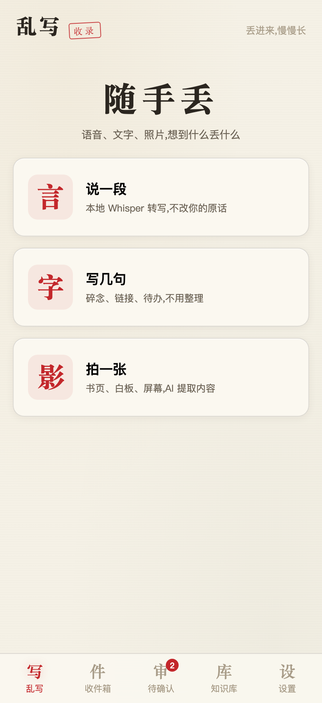
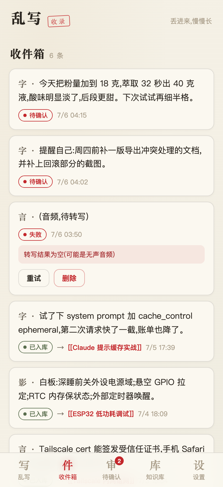
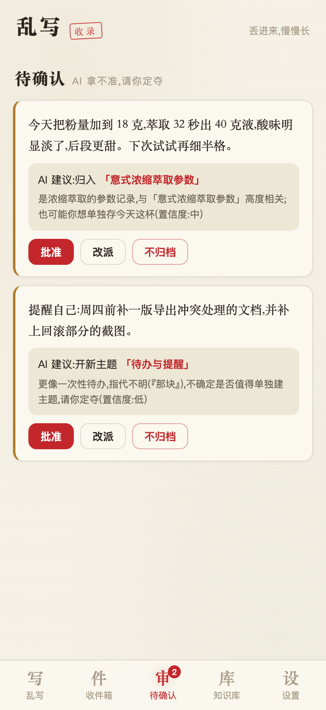
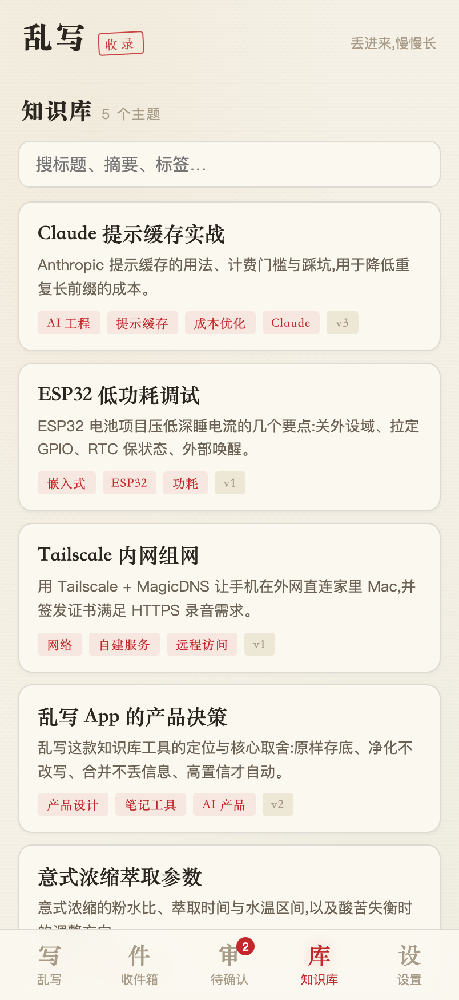
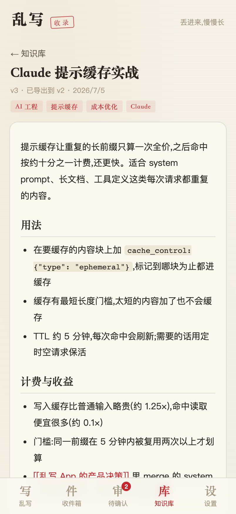
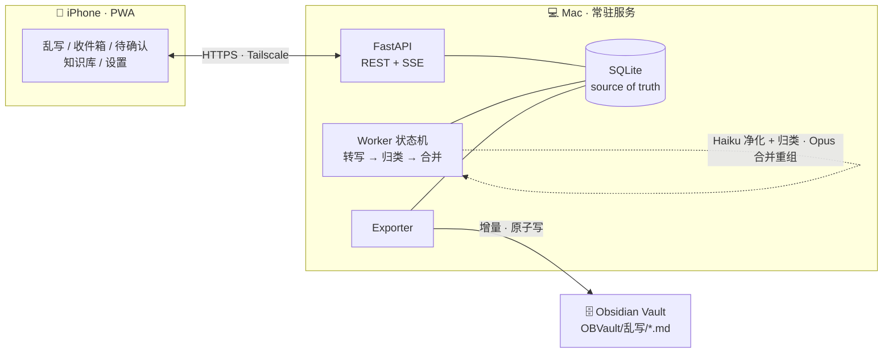
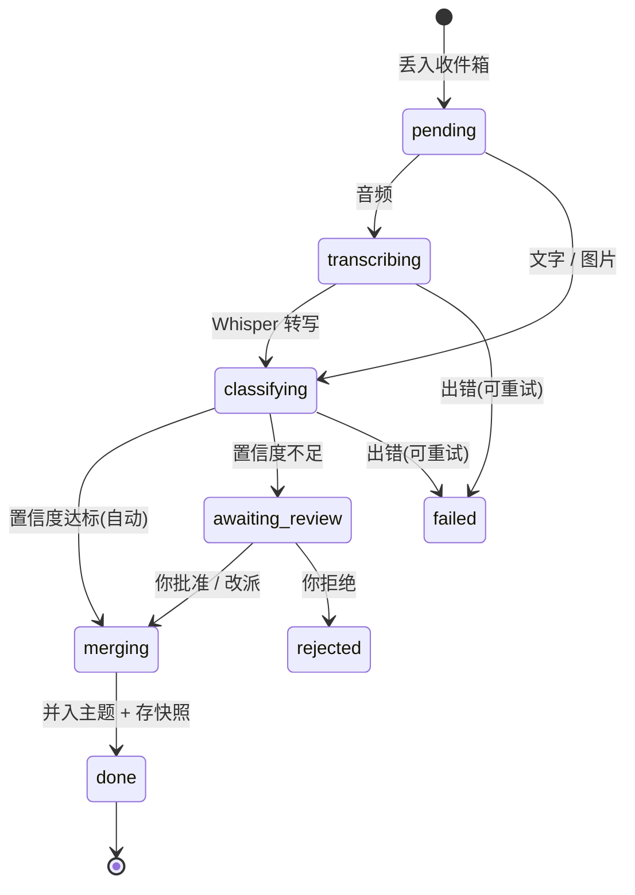

<div align="center">

# 乱写

**随手丢进语音、文字、照片,AI 帮你循序渐进地长出一座知识库,自动导出到 Obsidian。**

原文永远留底 · 净化不改写 · 合并可回滚 · 数据全在你自己的机器上

<p>
  
  
  
  
  
  
</p>

<p>
  <a href="#核心特性"><b>核心特性</b></a> ·
  <a href="#界面"><b>界面</b></a> ·
  <a href="#工作原理"><b>工作原理</b></a> ·
  <a href="#快速开始"><b>快速开始</b></a> ·
  <a href="#配置env"><b>配置</b></a> ·
  <a href="../../issues"><b>反馈</b></a>
</p>

<table>
  <tr>
    <td align="center" width="50%">
      <br/>
      <sub><b>随手丢</b> — 语音 / 文字 / 照片,想到什么丢什么</sub>
    </td>
    <td align="center" width="50%">
      <br/>
      <sub><b>收件箱</b> — 每条先原样存底,再看它怎么被处理</sub>
    </td>
  </tr>
  <tr>
    <td align="center" width="50%">
      <br/>
      <sub><b>待确认</b> — AI 拿不准的,你一键批准 / 改派 / 拒绝</sub>
    </td>
    <td align="center" width="50%">
      <br/>
      <sub><b>知识库</b> — 主题会自己长出来,越写越厚</sub>
    </td>
  </tr>
</table>

</div>

## 它解决什么

想法来的时候往往很碎:一段语音、几句吐槽、一张白板照片。传统笔记要你当场分好类、写清楚,于是大多数碎片根本没被记下来。

乱写反过来:**先无脑丢进来,整理交给 AI。** 每条碎片先原样存进收件箱,AI 在后台把它净化成干净文本、判断该归入哪个主题,拿得准就直接并进主题笔记,拿不准就留给你点一下。主题笔记越写越厚,最后增量导出到你自己的 Obsidian 仓库。

和常见做法比,乱写的取舍集中在三条铁律上——**原文不丢、转写不改写、合并不丢信息:**

| 维度 | 转写类笔记工具 | 云端「第二大脑」 | **乱写** |
|---|---|---|---|
| 原始素材 | 通常只留转写后的文本 | 上传到云端 | **原文 / 原音频 / 原图永久留底,任何 AI 结果都能重放** |
| 转写处理 | 可能顺手润色、改写 | — | **只去语气词、纠错别字,不改你的原话** |
| 并进笔记 | 多为末尾追加 | AI 自动重组,可能悄悄丢信息 | **合并带防缩水兜底,旧笔记的每条事实都保留** |
| 版本与回滚 | 少见 | 少见 | **每次合并都有快照 + diff + 一键回滚** |
| 数据归属 | 云端 | 云端 | **全在本地:SQLite + 你的 Obsidian** |

> 表中「转写类工具」「云端知识库」指的是这两类产品的常见做法,不针对具体某款。乱写这一列的每条都能在本仓库代码里找到对应实现。

## 核心特性

- **原样存底** — 每条乱写先进收件箱,原文 / 原音频 / 原图永久保留;任何一步 AI 结果都可回看、可重放。
- **净化不改写** — 本地 Whisper 转写,AI 只去口语语气词、修正明显错别字,不润色、不添意、不删意。
- **高置信自动归档** — AI 判断归属并给出置信度;拿得准的自动并入主题,拿不准的进「待确认」,你一键批准 / 改派 / 拒绝。
- **越写越厚** — 主题笔记随新碎片渐进重组:内容少时是简单列表,多了才自然分节,而不是每次都大洗牌。
- **可溯源、可回滚** — 每次合并都留版本快照,支持逐行 diff 与一键回滚;笔记末尾的「记录轨迹」把每条内容溯源到原始碎片。
- **导出到 Obsidian** — 增量导出为标准 Markdown(frontmatter + `[[双链]]`),原子写入,iCloud 不会同步到半截文件。
- **数据自持** — 全部落在本地 `data/`:`luanxie.db`(SQLite)+ `media/`(原始音频与图片),备份这一个目录即可。

## 界面

<div align="center">
  
  <p><sub>一篇被 AI 合并出来的主题笔记:渐进分节、行内代码、<code>[[双链]]</code>,末尾自带「记录轨迹」。</sub></p>
</div>

同一篇笔记展开「版本历史」后,可以逐行对比任意历史版本并一键回滚——
👉 [查看整页截图(版本历史 + diff + 回滚)](docs/assets/shot-detail-full.png)

## 工作原理

iPhone 上是一个 PWA,通过 Tailscale 走 HTTPS 连到常驻在 Mac 上的服务;所有数据和 AI 处理都在你自己的 Mac 上完成。



每条碎片都跑同一条串行流水线;串行消费天然避免两条碎片并发合并同一主题时打架:



- **转写** 用 [`mlx-whisper`](https://github.com/ml-explore/mlx-examples/tree/main/whisper) 在本地跑,不花钱、不出机器。
- **归类** 用便宜的 Haiku 一次调用完成「净化 + 主题匹配」。
- **合并** 用 Opus 把新碎片重写进主题笔记,并对「新版本明显变短」做防丢信息兜底。
- 崩溃恢复:非终态的碎片在服务重启时会自动重新入队。

## 快速开始

### 1. 环境要求

| 依赖 | 是否必需 | 说明 |
|---|:---:|---|
| macOS (Apple Silicon) 或 Linux / Windows | ✅ | 本地转写：macOS 默认使用 `mlx-whisper`；Linux/其他系统使用 `faster-whisper` |
| [uv](https://docs.astral.sh/uv/) | ✅ | 运行后端;首次会自动装好 Python 3.12 与依赖 |
| [Node.js](https://nodejs.org) 18+ | ✅ | 构建前端(`web/dist` 不在仓库里,首次必须自己 build) |
| `ANTHROPIC_API_KEY` | ✅ | 归类用 Haiku、合并用 Opus;没有它 AI 流水线不工作 |
| `ffmpeg` | ✅ | 语音转写必需，macOS 用 `brew install ffmpeg`，Linux 用 `sudo apt install ffmpeg` |
| [Tailscale](https://tailscale.com) | ⬜ | 仅手机端录音需要(HTTPS);只用文字 / 拍照可不装 |

检查前置:`uv --version`、`node --version`、`ffmpeg -version`。

### 2. 安装并启动

```bash
git clone https://github.com/its-rory/luanxie.git
cd luanxie

# 配置 API key
cp .env.example .env
# 用编辑器打开 .env,填入 ANTHROPIC_API_KEY

# 构建前端(首次必需 —— web/dist 不在仓库里)
cd web && npm install && npm run build && cd ..

# 启动(自动检测 Tailscale:有则 HTTPS,无则 HTTP)
./scripts/run.sh
```

`run.sh` 会打印实际监听地址:

- 没有 Tailscale → `http://<你的局域网IP>:8787`(手机端录音不可用)
- 有 Tailscale → `https://<你的主机名>.<tailnet>.ts.net:8787`

> 首次 `run.sh` 会由 `uv` 自动创建虚拟环境并安装依赖,可能要等一两分钟。首次语音转写还会下载约 1.5GB 的 whisper-turbo 模型。

### 3. 冒烟测试

服务起来后,另开一个终端:

```bash
curl -s http://localhost:8787/api/health
```

期望返回类似(字段可能更多,具体随环境而定)的 JSON:

```json
{"queue_depth":0,"db":".../data/luanxie.db","whisper_installed":true,"api_key_set":true,"auto_merge_confidence":"high","export_dir":".../OBVault/乱写"}
```

- 能看到这段 JSON,就说明后端装好并跑起来了。
- `api_key_set` 只表示 `.env` 里 `ANTHROPIC_API_KEY` 这一项**非空**,不代表这个 key 一定有效;为 `false` 才能确定是没配置或没被读到。真正验证 key 是否可用,要实际丢一条文字进「乱写」看它能不能被归类。
- 走的是 Tailscale HTTPS 模式时,改用 `curl -k https://localhost:8787/api/health`。

浏览器打开同一地址,看到「乱写 / 随手丢」首页即安装成功。

<!-- For AI agents / 非交互式安装:
  git clone https://github.com/janauto/luanxie.git && cd luanxie \
    && cp .env.example .env  # 需填 ANTHROPIC_API_KEY,否则 AI 流水线不工作(但冒烟测试仍会通过) \
    && ( cd web && npm install && npm run build ) \
    && uv run uvicorn server.main:app --host 127.0.0.1 --port 8787 &
  # 冒烟测试:curl -s http://localhost:8787/api/health  →  返回含 "queue_depth" 的 JSON 即成功
  # 注意:web/dist 不在仓库,必须先 build;mlx-whisper 仅支持 Apple Silicon;首次转写下载约 1.6GB 模型。
-->

## 手机使用(HTTPS,录音必需)

1. Mac 和 iPhone 都安装 [Tailscale](https://tailscale.com) 并登录同一账号。
2. `./scripts/run.sh` 会自动申请受信任证书并以 HTTPS 启动。
3. iPhone Safari 打开 `https://<你的Mac名>.<tailnet>.ts.net:8787`。
4. 分享 → 添加到主屏幕,即为原生般的 App。

> 拍照和文字在 HTTP 下也能用;只有录音必须 HTTPS(浏览器 secure context 限制)。

## 开机常驻与后台运行(可选)

### macOS (LaunchAgents)
让服务随 Mac 开机自启:

```bash
cp scripts/com.luanxie.server.plist ~/Library/LaunchAgents/
launchctl load ~/Library/LaunchAgents/com.luanxie.server.plist
```

> 仓库里的 plist 用的是示例路径。若你的项目不在 `~/Desktop/乱写`,先把 plist 里的 `ProgramArguments` 与 `WorkingDirectory` 改成你的实际路径。

### Linux (Systemd)
在 Linux 上，您可以使用 systemd 将其配置为系统服务：

1. 编辑 `scripts/luanxie.service`，将其中的 `WorkingDirectory` 和 `ExecStart` 路径修改为您的项目绝对路径。
2. 将服务文件复制到 systemd 系统目录：
   ```bash
   sudo cp scripts/luanxie.service /etc/systemd/system/
   ```
3. 重新加载配置并启动服务：
   ```bash
   sudo systemctl daemon-reload
   sudo systemctl enable luanxie
   sudo systemctl start luanxie
   ```
4. 查看服务状态或日志：
   ```bash
   sudo systemctl status luanxie
   # 或者使用 journalctl 查看日志
   journalctl -u luanxie -f
   ```

## 配置(.env)

| 变量 | 默认 | 说明 |
|---|---|---|
| `ANTHROPIC_API_KEY` | — | 必填 |
| `AUTO_MERGE_CONFIDENCE` | `high` | 自动合并门槛:`high` 稳妥 / `medium` / `low` 全自动 |
| `CLASSIFY_MODEL` | `claude-haiku-4-5` | 净化 + 归类(便宜) |
| `MERGE_MODEL` | `claude-opus-4-8` | 合并重组(质量敏感) |
| `VAULT_EXPORT_DIR` | `OBVault/乱写` | Obsidian 导出目录 |
| `EXPORT_INTERVAL_MINUTES` | `0` | 定时导出间隔,`0` = 仅手动 |

## 常见问题

<details>
<summary><b>打开是空白页,或只有 API 没有界面</b></summary>

`web/dist` 不在仓库里,首次必须自己构建:`cd web && npm install && npm run build`,然后重启服务。
</details>

<details>
<summary><b>手机上录不了音</b></summary>

录音需要 HTTPS(浏览器 secure context 限制)。用 Tailscale 让 `run.sh` 起 HTTPS,或先只用文字 / 拍照。
</details>

<details>
<summary><b>「待确认」一直堆着东西</b></summary>

`AUTO_MERGE_CONFIDENCE` 设得太保守。降到 `medium` 或 `low` 会更自动;或者直接去「待确认」逐条批准。
</details>

<details>
<summary><b>第一次语音转写很久</b></summary>

首次会下载约 1.6GB 的 whisper 模型,之后常驻内存、不再重复下载。
</details>

## 注意

- `OBVault/乱写/` 是**单向导出目标**,在里面手改的内容会被下次导出覆盖;要改笔记请在 App 里改(或改完别再导出该主题)。
- 首次语音转写会自动下载 whisper 模型(约 1.6GB,之后常驻内存)。
- 数据都在 `data/`:`luanxie.db`(SQLite)+ `media/`(原始音频图片)。备份这个目录即可。

## 许可证

本仓库暂未附带 `LICENSE` 文件。如需开源复用,请先与作者确认授权方式。

<div align="center"><sub><a href="#乱写">⬆ 回到顶部</a></sub></div>
