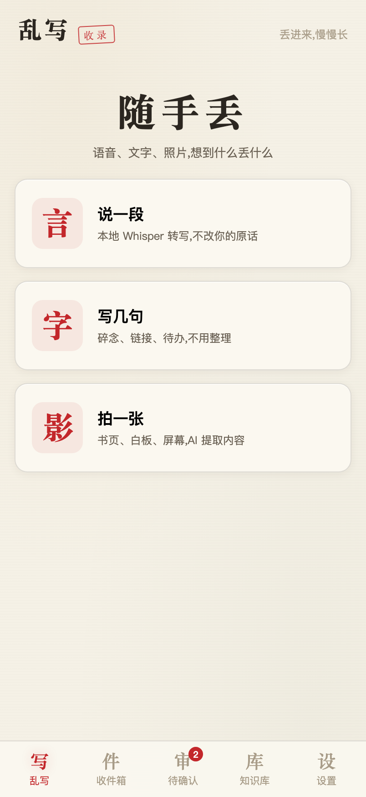
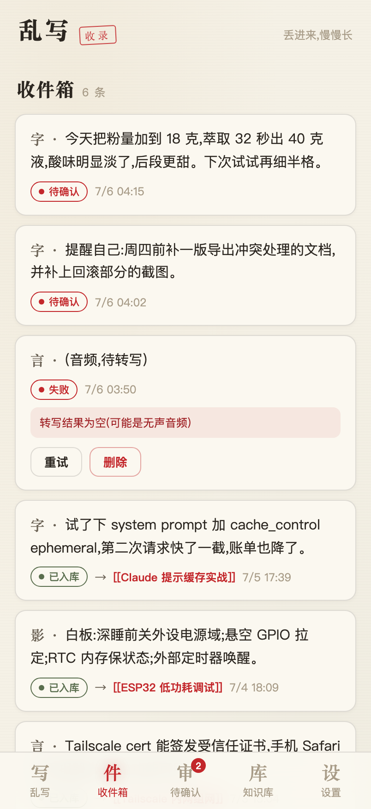
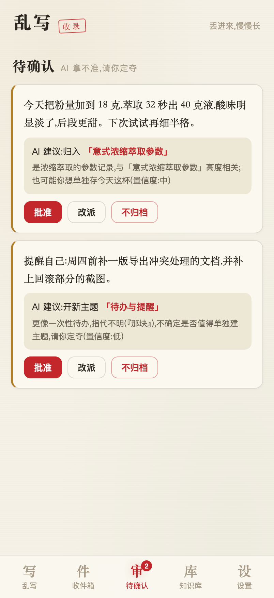
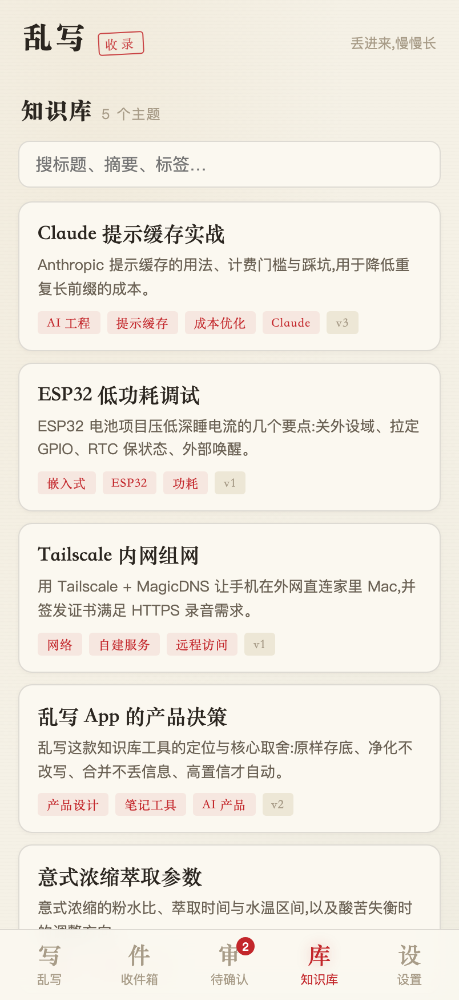
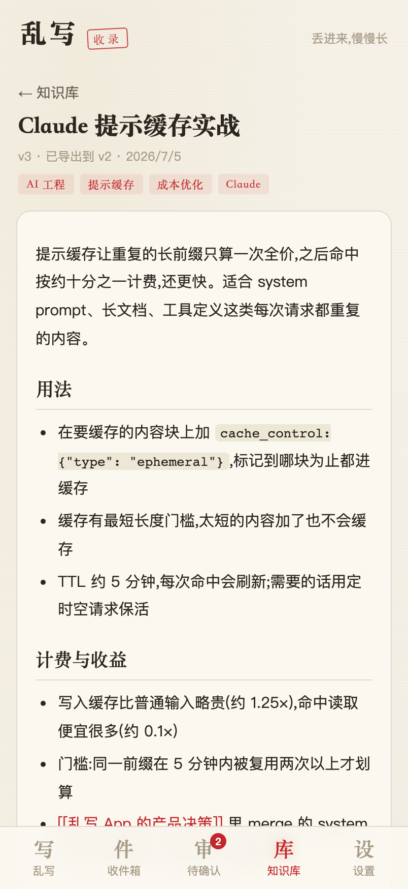
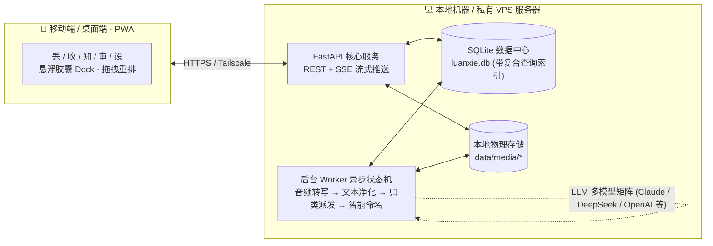
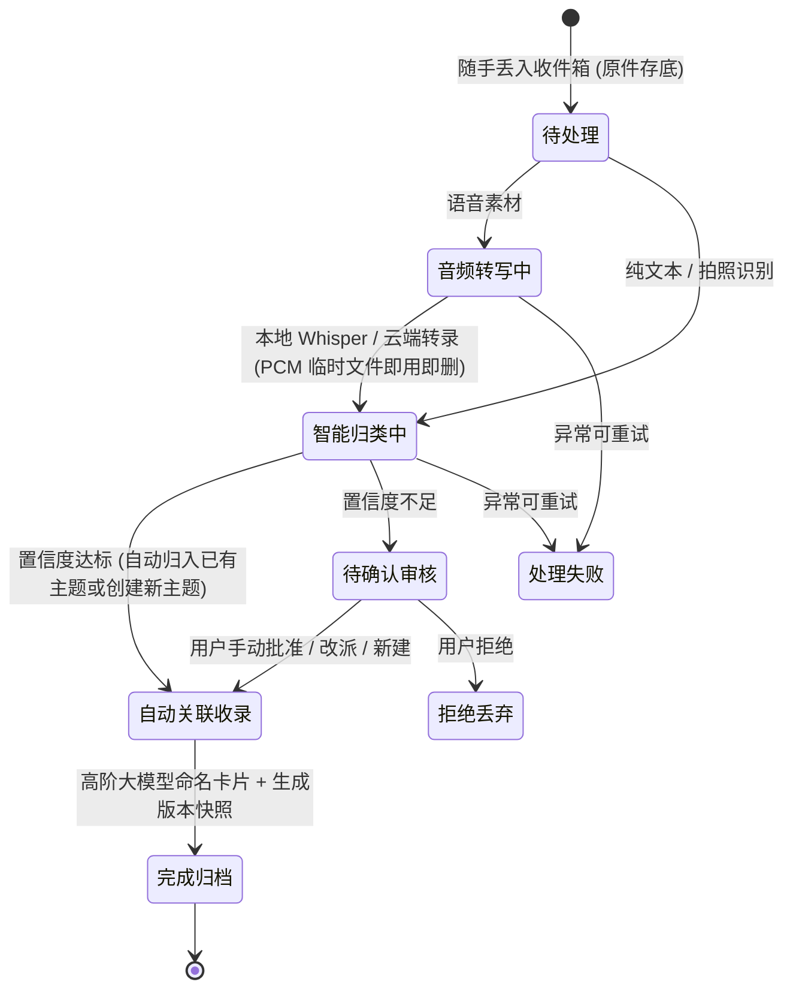

<div align="center">

# 乱写 (Luanxie)

**随手丢进语音、文字、照片，AI 帮你循序渐进地长出一座知识库。**

原文永远留底 · 净化不改写 · 卡片流式关联 · 双端拖拽排序 · 细粒度版本回滚 · 数据全在你自己的机器上

<p>
  
  
  
  
  
  
</p>

<p>
  <a href="#它解决什么"><b>解决什么</b></a> ·
  <a href="#核心特性"><b>核心特性</b></a> ·
  <a href="#界面速览"><b>界面速览</b></a> ·
  <a href="#工作原理"><b>工作原理</b></a> ·
  <a href="#快速开始"><b>快速开始</b></a> ·
  <a href="#配置说明env"><b>配置说明</b></a> ·
  <a href="https://github.com/its-rory/luanxie/issues"><b>反馈建议</b></a>
</p>

<table>
  <tr>
    <td align="center" width="50%">
      <br/>
      <sub><b>随手丢</b> — 语音 / 文字 / 照片，想到什么丢什么</sub>
    </td>
    <td align="center" width="50%">
      <br/>
      <sub><b>收件箱</b> — 原样存底、实时进度，卡片一键直达与光晕定位</sub>
    </td>
  </tr>
  <tr>
    <td align="center" width="50%">
      <br/>
      <sub><b>待确认</b> — AI 拿不准的，一键批准 / 改派 / 归档 / 拒绝</sub>
    </td>
    <td align="center" width="50%">
      <br/>
      <sub><b>知识库</b> — 主题长按拖拽重排，子卡片置顶与智能合并</sub>
    </td>
  </tr>
</table>

</div>

---

## 它解决什么

灵感与思考来临的时候往往转瞬即逝、极其碎片化：一段断断续续的语音、灵光一闪的几行文字、白板上随手绘制的草图。  
传统的知识管理工具总要求你“当场选分类、打标签、排版格式”，导致绝大多数碎片因摩擦成本过高而根本没有被记录下来。

乱写（Luanxie）彻底颠覆了这个流程：**先无脑丢进来，整理与提炼完全交给 AI。**
- 每条碎片原样存入收件箱，原始音频、图片与原文物理留底；
- AI 在后台进行净化（仅去口语语气词与错别字，绝不篡改原意）；
- 自动分析并推荐主题归属：高置信度的直接自动归入主题，拿不准的进入「待确认」供你一键定夺；
- 采用**子卡片流式关联**代替传统长文本大模型合并，杜绝长文本重写时的幻觉与信息蒸发；
- 数据全部保存在你自己的本地机器上（SQLite + 本地 media 文件），绝不上传云端第三方。

### 与其他笔记工具的理念对比

| 维度 | 转写类工具 | 云端「第二大脑」 | **乱写 (Luanxie)** |
|:---|:---|:---|:---|
| **原始素材** | 通常仅保留转写后的文本 | 托管在第三方云端 | **原文 / 原音频 / 原图永久留底，提供内置播放与溯源** |
| **文本处理** | 可能自动润色、改写、甚至添油加醋 | 强制套用特定模板 | **净化不改写：只去口语除杂、纠正错别字，保持原汁原味** |
| **笔记形态** | 多为长文本末尾机械追加 | AI 自动长文本重写，容易悄悄丢信息 | **主题包含多张独立子卡片，每张保留完整素材溯源与提炼结果** |
| **卡片与排版** | 固定顺序 | 固定顺序 | **双端长按拖拽重排（果冻回弹与震动反馈）、子卡片紧凑排序、支持全局置顶** |
| **主题操作** | 仅支持手动复制粘贴 | 封闭体系 | **支持主题多策略智能合并（按时间/最前/最后）、顶部三点快捷重命名与管理** |
| **版本与回滚** | 无或仅整篇粗粒度历史 | 依赖云端同步快照 | **每张子卡片拥有独立版本快照，支持直观逐行 diff 对比与一键秒级回退** |
| **数据归属** | 云端托管，有服务下线风险 | 云端订阅制，数据被锁死 | **100% 数据自持：本地 SQLite + media/，一个目录带走全部资产** |

---

## 核心特性

### 1. 随手丢与原样留底 (Capture & Keep-Everything)
- **多模态输入**：支持手机/网页麦克风高清录音、多段文字速记、以及拍照/相册图片上传。
- **原始素材永久存底**：原文、原音频（集成高性能原生 Web Audio 播放控件）、原图永久留存在服务器本地，每一步 AI 处理结果均可追溯、可重放。
- **安全与零孤儿文件**：音频转写采用内存/临时文件瞬时处理并自动物理清除，子卡片删除时自动在数据库事务中闭环删除物理磁盘媒体文件，彻底避免磁盘垃圾与孤儿文件累积。

### 2. 净化不改写 (Cleanse Without Alteration)
- 语音由本地 Whisper 模型（macOS Apple Silicon 深度优化 `mlx-whisper`，Linux/Windows 使用 `faster-whisper`）或云端 API（支持 OpenAI / Groq / SiliconFlow 等）精准转写。
- 音频在上传云端 API 前自动通过本地 `ffmpeg` 转码并高效压缩为极小单声道 mp3。
- AI 流水线只做**去口语语气词、修正错别字**的净化处理，**不润色、不添意、不删意**，忠实保留记录者的原话和思考痕迹。

### 3. 主题子卡片流式架构 (Sub-Card Architecture)
- 摒弃了将多条碎片使用大模型暴力合并为单一长文档的传统做法，采用**多张独立子卡片流式拼接**的架构。
- 每条碎片在主题中独立成卡，既保持了主题的上下文关联，又完美保留了单条思考的独立时间戳、原始多媒体素材与清洗版本。
- 由高阶的大模型作为“合并 AI”为收纳的子卡片及开辟的新主题自动生成专业、精炼的标题，亦可随时手动修改。

### 4. 双端拖拽重排与触觉反馈 (Jelly Physics Sortable)
- **主题卡片拖拽重排**：在知识库列表长按任意主题卡片即可进入拖拽模式，调整主题展示先后顺序。集成平滑的果冻物理回弹动效（`cubic-bezier` 缓动曲线）与设备振动触觉反馈，PC 端鼠标与移动端触屏均原生顺滑。
- **子卡片紧凑重排模式**：在主题详情中点击「排序」，子卡片自动折叠收拢为极简单行卡片（`#N: 标题`），右侧提供 `☰` 抓手拖拽，顶部常驻「完成」与「取消」操作，长列表重排省心高效。

### 5. 丰富的卡片管理与快捷操作 (Card Menu & Topic Actions)
- **子卡片三点 (`···`) 菜单**：每张子卡片右上角集成现代极简操作菜单：
  - ✏️ **编辑内容与标题**：支持就地即时编辑与保存；
  - 📋 **一键复制 Markdown**：清洗排版后的格式化内容直接复制到系统剪贴板；
  - 📌 **一键全局置顶**：重要卡片始终固定在主题最顶部，带有高亮图钉标识；
  - 🔀 **调整排序**；
  - 📊 **实时字数统计**；
  - 🗑️ **删除卡片**（联动清理物理磁盘关联文件）。
- **主题主标题顶部三点 (`···`) 菜单**：
  - 🔀 **智能合并主题**：支持将当前主题一键迁移并入另一个目标主题，提供三种合并排序策略：
    1. **按时间排序**：保持卡片原生创建时间流混入目标主题；
    2. **移至最前**：合并入的卡片整体插在目标主题头部；
    3. **移至最后**：合并入的卡片整体追加在目标主题尾部。
  - ✏️ **编辑主题标题**：内联就地重命名，正下方提供直观的「保存」与「取消」按钮，告别长页滚动的烦躁；
  - 🗑️ **删除此主题**：带确认提示的安全级联删除。

### 6. 收件箱直达卡片与呼吸高亮 (Inbox Direct Jump & Pulse Highlight)
- 在收件箱中点击处理完成的关联主题（如 `[[目标主题]]`），前端将自动平滑路由跳转至该主题页面；
- 页面自动定位并平滑滚动到对应子卡片，卡片自带 **3 秒专属蓝色光晕呼吸脉冲动效** 与 `🎯 来自收件箱` 定位角标，海量笔记中查找如探囊取物。

### 7. 细粒度版本快照与逐行 Diff 回滚 (Version Snapshots & Rollback)
- 每张子卡片均拥有独立的版本演变历史；
- 卡片底部直观呈现生成时间与版本数量入口，展开「版本历史」即可直观对比每一次编辑的**逐行差异（Diff）**，并支持随时**一键秒级回退**至任意历史版本。

### 8. 多模型解耦、动态协议提示与优雅设置 (Multi-Modal Settings)
- **服务商集中管理**：同时支持 OpenAI 兼容协议与 Anthropic 原生协议，设置页协议切换时，**AI 地址（Base URL）动态智能展示系统自动追加的路径后缀提示**（如 `/v1/chat/completions` 或 `/v1/messages`），输入框与说明文本完全联动。
- **任务模型解耦**：将文本净化归类 (Text)、图像理解 (Image)、音频转录 (Audio)、卡片提炼 (Merge) 4 组任务模型独立解耦，可按需配置不同主力大模型，并提供前端一键连通性测试。
- **界面美化**：管理员密码管理与服务商列表统一采用无缝平铺的现代化横排按钮风格。

### 9. 现代悬浮胶囊 Dock 栏与 PWA 体验 (Modern Dock & PWA)
- 底部导航升级为极简悬浮胶囊 Dock（`丢` / `收` / `知` / `审` / `设`），支持移动端全屏手势安全区（`safe-area-inset-bottom`）自适应。
- 完整支持 PWA 特性，可直接在手机 Safari / Chrome 点击「添加到主屏幕」，享受原生 App 般的丝滑全屏体验。

### 10. 数据绝对自持 (100% Local Data Ownership)
- 所有结构化数据存放在本地 SQLite（`data/luanxie.db`），所有原图、原音频存放在本地 `data/media/`。
- 无任何隐式云端上报，数据主权 100% 归你所有；只需备份 `data/` 目录即可打包带走整套知识库。

---

## 界面速览

<div align="center">
  
  <p><sub>主题详情：主标题快捷三点菜单、子卡片右上角操作、专属置顶徽标与流式拼接</sub></p>
</div>

展开任意子卡片的「历史版本」后，可进行清晰的逐行对比并一键无损回滚——  
👉 [查看整页截图（版本历史 + diff 对比 + 一键回滚）](docs/assets/shot-detail-full.png)

---

## 工作原理

手机端或桌面浏览器作为客户端（PWA），通过安全连接与后端的 FastAPI 服务交互；核心流水线、数据库及媒体文件全部驻留在你的本地或私有服务器上。


```mermaid
flowchart LR
    subgraph client["📱 移动端 / 桌面端 · PWA"]
      UI["丢 / 收 / 知 / 审 / 设<br/>悬浮胶囊 Dock · 拖拽重排"]
    end

    subgraph host["💻 本地机器 / 私有 VPS 服务器"]
      API["FastAPI 核心服务<br/>REST + SSE 流式推送"]
      DB[("SQLite 数据中心<br/>luanxie.db (带复合查询索引)")]
      FS[("本地物理存储<br/>data/media/*")]
      W["后台 Worker 异步状态机<br/>音频转写 → 文本净化 → 归类派发 → 智能命名"]
      
      API <--> DB
      API <--> FS
      W <--> DB
      W <--> FS
    end

    client <-->|"HTTPS / Tailscale"| API
    W -. "本地 Whisper (Apple Silicon / CUDA) 或 云端 API 转写 (FFmpeg 极速压包)" .-> W
    W -. "LLM 多模型矩阵 (Claude / DeepSeek / OpenAI 等)" .-> W
```

### 碎片处理流水线状态机

每条投入的素材均经过串行状态机，天然规避并发冲突与竞态：


```mermaid
stateDiagram-v2
    [*] --> 待处理: 随手丢入收件箱 (原件存底)
    待处理 --> 音频转写中: 语音素材
    待处理 --> 智能归类中: 纯文本 / 拍照识别
    音频转写中 --> 智能归类中: 本地 Whisper / 云端转录 (PCM 临时文件即用即删)
    智能归类中 --> 自动关联收录: 置信度达标 (自动归入已有主题或创建新主题)
    智能归类中 --> 待确认审核: 置信度不足
    待确认审核 --> 自动关联收录: 用户手动批准 / 改派 / 新建
    待确认审核 --> 拒绝丢弃: 用户拒绝
    自动关联收录 --> 完成归档: 高阶大模型命名卡片 + 生成版本快照
    音频转写中 --> 处理失败: 异常可重试
    智能归类中 --> 处理失败: 异常可重试
    完成归档 --> [*]
```

---

## 快速开始

### 1. 环境准备

| 运行环境 | 是否必需 | 说明 |
|:---|:---:|:---|
| **操作系统** | ✅ | macOS (Intel / Apple Silicon)、Linux、Windows 均可稳定运行 |
| [**uv**](https://docs.astral.sh/uv/) | ✅ | 极速现代 Python 包管理工具，推荐搭配 Python 3.12 虚拟环境 |
| [**Node.js**](https://nodejs.org) (18+) | ✅ | 用于构建 React 前端（`web/dist` 不提交至仓库，首次部署必须打包） |
| **管理员密码** | ✅ | `ADMIN_PASSWORD`：登录凭证（至少 6 位，禁止用 `admin`）。留空则全站锁定防爆破 |
| **模型 API Key** | ✅ | 配置大模型服务商密钥（支持 OpenAI 协议、Anthropic 原生协议） |
| [**ffmpeg**](https://ffmpeg.org/) | ✅ | 语音转码与云端转录压缩必需（macOS 执行 `brew install ffmpeg`，Linux 执行 `sudo apt install ffmpeg`） |
| **HTTPS 证书 / Tailscale** | ⬜ | 手机浏览器录音需 HTTPS 安全上下文环境（若仅使用文字与照片，普通 HTTP 即可） |

### 2. 获取代码与安装

```bash
# 1. 克隆代码仓库
git clone https://github.com/its-rory/luanxie.git
cd luanxie

# 2. 配置环境变量
cp .env.example .env
# 用编辑器修改 .env，务必设置 ADMIN_PASSWORD 以及对应的大模型服务商密钥

# 3. 编译前端
cd web && npm install && npm run build && cd ..

# 4. 初始化 Python 虚拟环境与依赖
uv venv --python 3.12

# 5. 启动服务 (推荐使用 run.sh 脚本一键启动，内置 --no-sync 极速防挂起模式)
bash scripts/run.sh
```

> **提示**：
> - 后续也可以直接使用 `uv run --no-sync uvicorn server.main:app --host 0.0.0.0 --port 8787` 启动；
> - 若使用本地 Whisper 且未配置云端转写 API，初次转写会自动下载约 1.6GB 的 whisper 基础模型。

### 3. 验证运行状态

服务启动后，可在终端运行探活指令：

```bash
curl -s http://localhost:8787/api/health
```

返回正常的 JSON 状态即代表就绪：
```json
{
  "queue_depth": 0,
  "whisper_installed": true,
  "local_whisper": true,
  "cloud_whisper": true,
  "api_key_set": true,
  "auto_merge_existing_confidence": "medium",
  "auto_merge_new_confidence": "high"
}
```

使用浏览器访问 `http://<你的机器IP>:8787`，使用刚刚设置的管理员密码登录即可开始记录。

---

## 手机端安装与使用 (PWA / HTTPS)

由于现代移动端浏览器安全规范（Secure Context），麦克风录音权限必须在 **HTTPS** 或 `localhost` 环境下开启（文字与拍照在普通 HTTP 下均可正常使用）。

推荐通过 **Tailscale** 或 **1Panel/Nginx 反向代理** 搭配使用：

1. 手机与运行服务的服务器均加入同一个 [Tailscale](https://tailscale.com) 局域网网络；
2. 运行 `scripts/run.sh`，脚本支持自动配置 HTTPS 访问；
3. 在 iPhone Safari 或 Android Chrome 中访问对应地址；
4. 点击浏览器的 **分享**（或菜单）→ 选择 **「添加到主屏幕」**，即可像原生 App 一样直接从手机桌面秒开启动！

---

## 开机常驻与后台服务 (Systemd / Launchd)

### Linux (Systemd)

在 Linux 服务器上，通过 systemd 可以实现开机自启与进程守护：

```bash
# 1. 编辑 scripts/luanxie.service，检查 WorkingDirectory 和 ExecStart 路径
# 2. 复制到系统服务目录
sudo cp scripts/luanxie.service /etc/systemd/system/

# 3. 启动并启用开机自启
sudo systemctl daemon-reload
sudo systemctl enable luanxie
sudo systemctl start luanxie

# 4. 检查运行状态与日志
sudo systemctl status luanxie
journalctl -u luanxie -f
```

### macOS (LaunchAgents)

在 Mac 上，使用 launchd 随系统登录启动：

```bash
cp scripts/com.luanxie.server.plist ~/Library/LaunchAgents/
launchctl load ~/Library/LaunchAgents/com.luanxie.server.plist
```

---

## 配置说明 (.env)

> 💡 **提示**：除了在 `.env` 中初始化配置外，所有模型服务商、四组任务模型、置信度策略及管理员密码均可在系统的 **「设置」** 页面直接在可视化 UI 中随时新增、修改、测试与保存。

| 配置项 | 默认值 | 说明 |
|:---|:---|:---|
| `ADMIN_PASSWORD` | —（**必填**） | 管理员密码（至少 6 位，勿用 `admin`）。留空则系统强制锁定防爆破 |
| `PORT` | `8787` | 服务监听端口 |
| `TEXT_MODEL` | `claude-haiku-4-5` | 文本净化与归类的主力模型名（如使用 OpenAI 协议推荐 `deepseek-ai/DeepSeek-V3`） |
| `MERGE_MODEL` | `claude-opus-4-8` | 子卡片与主题智能提炼命名的模型名（推荐使用推理能力更强的大模型如 `deepseek-ai/DeepSeek-R1`） |
| `IMAGE_MODEL` | — | 图像理解与多模态模型名（可选，不配则自动忽略图片理解） |
| `AUDIO_MODEL` | `whisper-1` | 云端转写模型名（若配置了云端语音转写 API） |
| `AUDIO_BASE_URL` | `https://api.openai.com/v1` | 语音转写服务基础地址（如使用硅基流动可填 `https://api.siliconflow.cn/v1`） |
| `AUTO_MERGE_EXISTING_CONFIDENCE` | `medium` | 归入**已有主题**的自动收纳门槛：`high`（严谨）/ `medium`（平衡）/ `low`（全自动）/ `never` |
| `AUTO_MERGE_NEW_CONFIDENCE` | `high` | 开辟**全新主题**的自动收纳门槛：`high` / `medium` / `low` / `never` |
| `SESSION_COOKIE_SECURE` | `auto` | Cookie 传输安全标识：`auto`（随请求协议动态匹配）/ `always`（强制 HTTPS）/ `never` |
| `TRUSTED_PROXIES` | — | 受信反向代理 IP（逗号分隔）。仅受信 IP 才会解析 `X-Forwarded-For` 头，有效防御登录限频绕过 |

---

## 常见问题 (FAQ)

<details>
<summary><b>Q1: 打开网页出现空白页，或者只有 API 404 / 缺少界面？</b></summary>

因为前端编译产物 `web/dist` 遵循最佳实践并未包含在 git 仓库内。请在根目录执行：
```bash
cd web && npm install && npm run build
```
编译完成后重启后端服务即可正常加载前端界面。
</details>

<details>
<summary><b>Q2: 手机端点击麦克风提示无权限或无法录音？</b></summary>

这是现代移动端浏览器（Safari / Chrome）的安全策略限制：麦克风等设备传感器必须在 **HTTPS** 或 `localhost` 安全上下文（Secure Context）下才能调用。  
可通过搭建 Tailscale 虚拟局域网、或使用 Nginx / 1Panel 配置 SSL 证书反向代理访问。文字记录与拍照在普通 HTTP 下不受影响。
</details>

<details>
<summary><b>Q3: 收件箱 / 待确认列表总是堆积很多条目，无法自动归档？</b></summary>

可能是因为将自动合并置信度门槛设得过于严苛。您可以在「设置」页将“已有主题合并门槛”调整为 `medium` 或 `low`；也可以直接在「待确认」页面一键点击“批准”或“改派”。
</details>

<details>
<summary><b>Q4: 第一次进行语音转写时耗时较长？</b></summary>

如果您没有配置云端转录 API，系统会在本地首次收到语音时自动从 HuggingFace / 镜像站下载对应的 Whisper 模型（约 1.6GB），下载完毕后模型将常驻内存，后续所有本地转写均为秒级响应。
</details>

<details>
<summary><b>Q5: 如何备份我所有的笔记和原始素材？</b></summary>

乱写采用极致纯粹的本地架构，所有资产均位于项目根目录下的 `data/`：
- `data/luanxie.db`：全量 SQLite 数据库（包含全部笔记、子卡片、版本历史与设置）；
- `data/media/`：所有的原图与录音文件。  
直接复制、备份或同步这个 `data/` 目录即可，迁移服务器时只需将 `data/` 拷贝到新机器对应位置。
</details>

---

## 许可证

本项目源码仅供个人自托管使用。如需商用、闭源分发或二开集成，请先联系作者获得授权。

<div align="center"><sub><a href="#乱写-luanxie">⬆ 回到顶部</a></sub></div>
